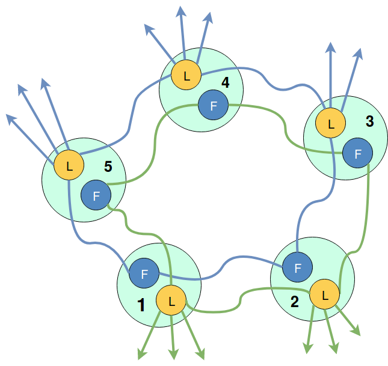

## Extensions

### Biased CacheTorrent 

The biased CacheTorrent idea is simple: use the original CacheTorrent protocol, but the underlying network that we will use is based on a Tracker which generates a biased BitTorrent topology with k set to 50% of the neighbors.

The original biased selection algorithm proposed by [Bindal et. al.](https://ieeexplore.ieee.org/abstract/document/1648853/). They propose the following neighbor selection for a node:
 - k neighbors within other ISPs
 - n − k neighbors from the same ISP

This idea is particularly interesting since it modifies the BitTorrent random topology into a biased topology with a bigger degree of connections inside the same autonomous system. Our implementation is straight-forward: modify the tracker to return a biased topology when returning the 'Neighbours' messages.

### MultiTorrent 

The main idea of MultiTorrent is splitting a torrent into smaller sub-torrents. This can be useful as long as the number of resulting pieces and file sizes are reasonably large.

In large lines, the protocol works as follow:
- each **MultiPeer** is split into multiple **ProxyPeers**
- each **ProxyPeer** is a wrapper around a CacheTorrent Peer and uses a **StripProxy** Transport to send a message to another **ProxyPeer**
- multiple **ProxyPeers** form a Torrent
- the leaders for all the Torrents are chosen via a **MultiElection**
- each Torrent is responsible for a different subset of pieces of the initial piece selection

For more details refer to the **godoc**.

