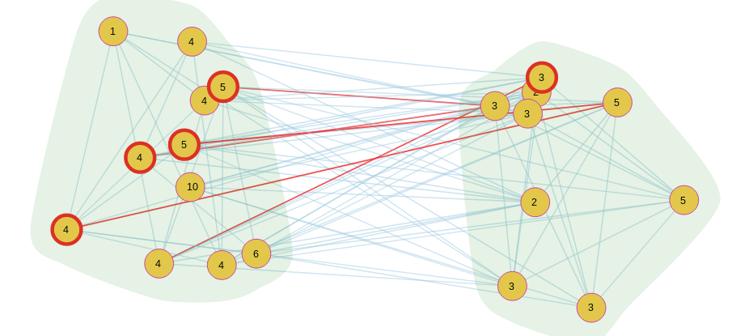
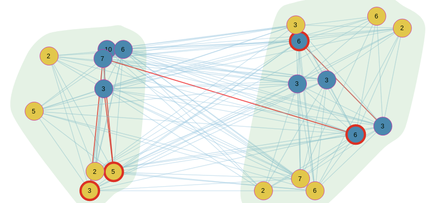

## User guide

### Running a simulation

To run a simulation use:
```
go run main.go
```

The supported options are:
```
  -bias int
    	Number of outgoing connections for a biased Tracker.
  -cdf
    	Enable printing time cumulative distribution function.
  -choker string
    	The strategy used by the Choker. We support TitForTat and Random. (default "TitForTat")
  -conf string
    	The path to configuration .json file. (default "./confs/small.json")
  -cpuprofile file
    	Write cpu profile to file.
  -ext int
    	Use the extesion with ext percent number of leaders.
  -latency
    	Enable control packet latency.
  -leaders
    	Enable printing leader and follower times.
  -log .json
    	The packet log in .json format.
  -memprofile file
    	Write memory profile to file.
  -multi int
    	The number of subnodes of a virtual node for MultiTorrent protocol.
  -parallel
    	Run the simulator's event queue with support for parallel events.
  -pieceSize int
    	The size of a piece from the file. (default from configuration file)
  -pieces int
    	Number of pieces the file has. (default from configuration file)
  -procs int
    	GOMAXPROCS (default 4)
  -v	Verbose output.
```

### Configuration files

The simulation need a configuration file to run. If no configuration file is provided via the flag `-conf`, the default simulation file `./confs/small.json` will be used.

We have a set of default configuration files that we used during our tests in the folder `confs`. The configuration file needs to be provided in a JSON format. An example configuration is:
```
{
  "outPeers" : 5, // number of possible outgoing connections
  "inPeers"  : 5, // number of maximum incoming connections

  "minNodes" : 20, // minimum number of nodes in the simulation
  "seeds"    : 1,  // number of seeds in the simulation

  "pieceSize" : 196, // the piece size in bits
  "pieces"   : 1000, // the number of pieces

  "uploads"     : 4, // the number of (simultaneous) upload connections for a peer
  "optimistics" : 1, // number of random upload connections for a peer
  "interval"    : 10000, // the rechoking interval in milliseconds

  "backlog" : 10, // the size of the backlog: maximum number of
                  // simultaneous requests made at a time by a peer

  "transitDomains"    : 10, // number of transit domains in router topology
  "transitDomainSize" : 50, // size of a transit domain(in routers)
  "stubDomains"       : 2,  // number of stub domains
  "stubDomainSize"    : 50, // size of a stub domain(in routers)

  "transferInterval"  : 10, // the interval at which data transfer is simulated(in milliseconds)

  //  array of nodes with their upload and download capacities
  "capacityNodes" : [{
      "number"   : 1, // the seed
      "upload"   : 20,
      "download" : 0
  }, {
      "number"   : 20, // the nodes
      "upload"   : 10,
      "download" : 20,
  }],

  // a progress property which ensures that all the nodes will run
  // at least one time in an interval(in milliseconds)
  "allNodesRunInterval" : 10
}
```

### Examples

- BitTorrent protocol:
  - `go run main.go -v`
- CacheTorrent protocol with 50% leaders:
  - `go run main.go -ext=50 -v`
- MultiTorrent protocol with 2 sub-Torrents and 50% leaders:
  - `go run main.go -multi=2 -ext=50 -v`
- Biased BitTorrent protocol with 20% external connections:
  - `go run main.go -v -bias=50`
- Biased CacheTorrent protocol with 20% external connections and 50% leaders:
  - `go run main.go -ext=50 -bias=20 -v`
- BitTorrent protocol with latency module running on a 2 core processor:
  - `go run main.go -latency -v -parallel -procs=2`
- CacheTorrent protocol with all measurements on:
  - `go run main.go -ext=50 -v -cdf -leaders`

### Visualization tool

To run the visualization tool:

```
./visual.sh
```

The visualization tool back-end runs on `localhost:8080`.




